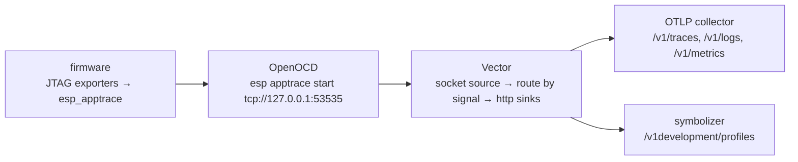

# jtag example

Every signal over one JTAG app-trace channel. `main.cpp` constructs a
`Jtag*Exporter` per signal and passes each to the matching
`esp_opentelemetry_*_setup()` call. Each document is written as OTLP/JSON —
the same encoding the OTLP/HTTP exporters send, one document per line — and
OpenOCD streams the channel to a host-side forwarder that POSTs each line to
an OTLP collector. The device needs no network connection.



The four signals interleave on one channel, so the exporters serialise on a
whole document: a line is always one complete request body, never a mix.

## What to observe

The firmware emits, once a second, a `work.iteration` span with a `work.step`
child, an `iterations` counter increment, an "iteration complete" log record,
and `emitted iteration N` on the serial console; the profiler exports a
`ProfilesData` document every 5 s. Once the pipeline is up, the collector
receives one request per document, all carrying
`"service.name": "jtag-example"`.

## Build and flash

```sh
idf.py build
idf.py -p /dev/ttyACM0 flash
```

The example requires the app-trace transport with the JTAG destination
(`CONFIG_ESP_TRACE_TRANSPORT_APPTRACE`, `CONFIG_APPTRACE_DEST_JTAG`) and
`CONFIG_ESP_OPENTELEMETRY_EXPORTER_JTAG` to compile the exporters in; all are
set in `sdkconfig.defaults`.

## Run the host pipeline

Start the forwarder first — OpenOCD connects to it as a TCP client and gives
up if nothing is listening:

```sh
vector --config vector.yaml
```

`vector.yaml` listens on `0.0.0.0:53535`, splits the stream on newlines,
routes each line by its top-level `resourceSpans` / `resourceLogs` /
`resourceMetrics` / `resourceProfiles` key, and POSTs it to the matching
endpoint. Narrow `address` to `127.0.0.1` when OpenOCD runs on the same host,
and point each `uri` at your own collector if it is elsewhere. Profiles go to
the symbolizer (`tools/symbolizer/`), not the collector, because the device
ships raw program counters.

Then attach OpenOCD and start the app-trace stream. For a board with the
built-in USB JTAG (ESP32-S3, ESP32-C3, …):

```sh
openocd -f board/esp32s3-builtin.cfg \
        -c "init" \
        -c "esp apptrace start tcp://127.0.0.1:53535 0 -1 -1 0 0"
```

`init` is required: `esp apptrace` refuses to run before the target is
initialised. The command returns as soon as tracing has started and the
polling continues in the background, so leave OpenOCD running — adding
`-c "shutdown"` ends the capture immediately.

The trailing arguments are OpenOCD's `poll_period trace_size stop_tmo
wait4halt skip_size`: poll as fast as possible, no size limit, no stop
timeout, do not wait for a halt, skip nothing. With an external JTAG adapter,
replace the board config with the one for your probe.

To inspect the raw stream without a collector, point OpenOCD at a file
(`file:///tmp/apptrace.json`) or listen with `nc -l 53535` in place of Vector.
Each line is a complete OTLP/JSON document.

## Timestamps

The exporter runs with no network, so nothing sets the system clock. On a
board powered on cold, SNTP never runs and `std::chrono::system_clock::now()`
returns 1970 plus uptime; span timestamps are then decades old, and a backend
that rejects old data (Loki's `reject_old_samples`, for one) drops them even
though the export itself succeeded. A board that was synced earlier and has
only been soft-reset keeps the correct time — ESP-IDF holds the boot-time
offset in RTC memory, which survives a reset but not a power cycle, so the
symptom appears intermittently. Bring up SNTP, or rewrite the timestamps
host-side, before pointing this at a production backend.

## Dropped spans

The app-trace channel is lossy by design: OpenOCD reports `CRC mismatch!` for
a block it could not read cleanly, and the exporter drops a whole document
when a write times out. Both cost individual spans, not the stream: each
document is one line, and a partially written one is terminated so the next
still parses.

A drop is logged on the device but still reported to the SDK as a successful
export, because `OtlpFileAppender::Export` returns `void` and gives
`OtlpFileClient` no failure to propagate. Count the spans that reach the
collector rather than trusting the export result.

## Backpressure

With no host connected, app-trace runs in post-mortem mode: buffers are
recycled without waiting for anyone to read them, so writes return immediately
and the spans are simply overwritten. The example's loop keeps its ~1.1 s
period whether or not OpenOCD is attached.

`CONFIG_ESP_OPENTELEMETRY_JTAG_TIMEOUT_US` bounds the other case: a
host *is* connected but has not yet drained the pending block, where a write
waits up to that long before the document is dropped. The log and metric
signals export from their own Batch processor thread, so that wait is paid
there; this example wires spans to a `SimpleSpanProcessor`, which has no such
thread, so a span-ending call pays the wait directly. Lower the timeout (0
never blocks) if the firmware is timing-sensitive.
